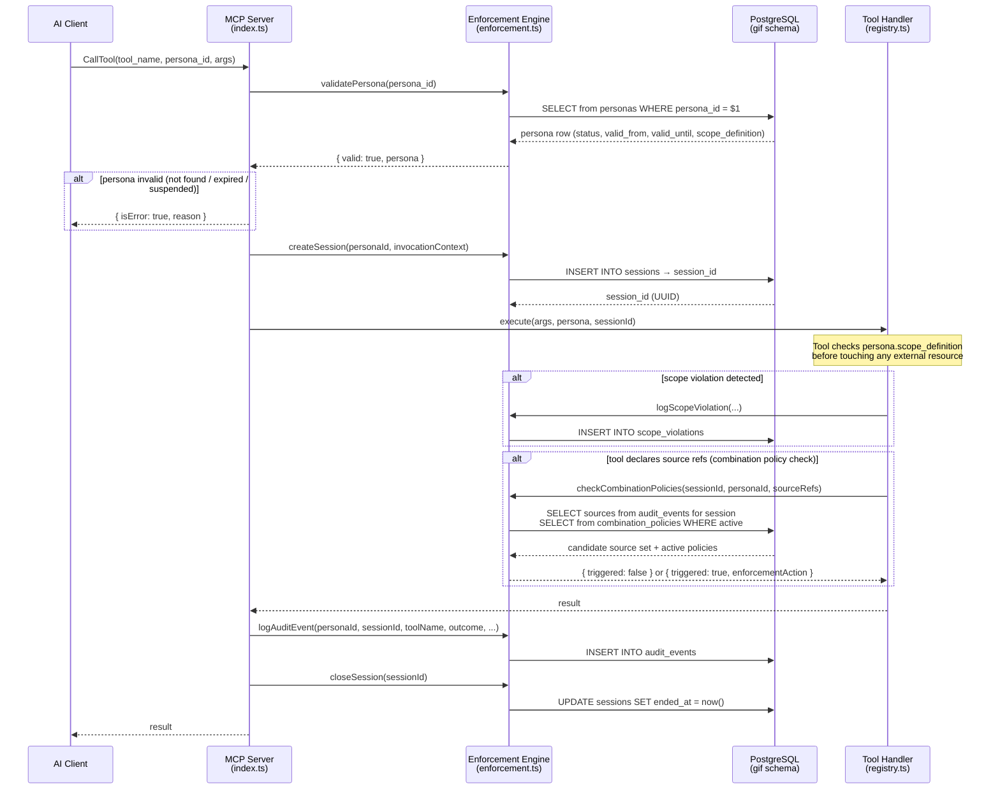
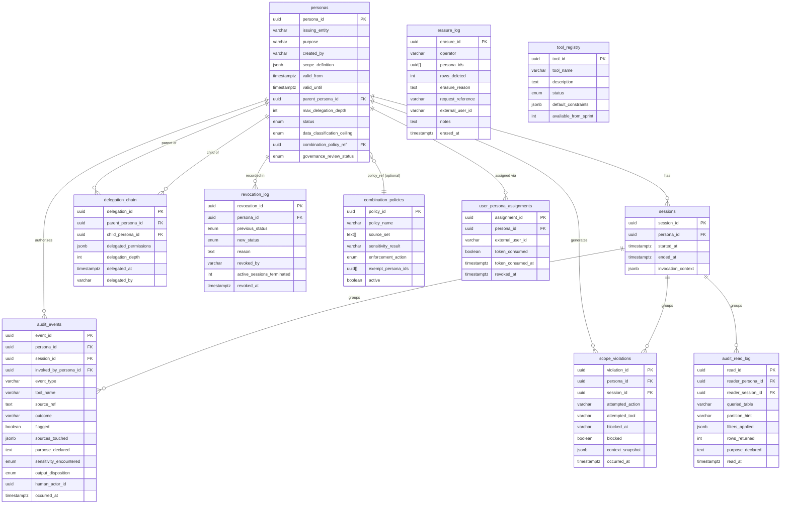
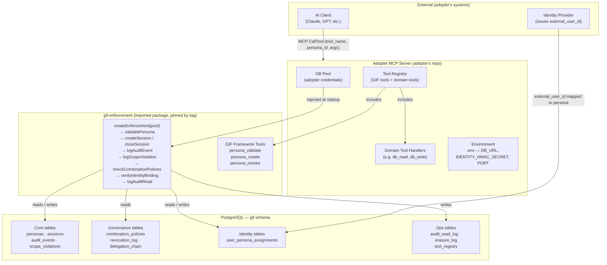
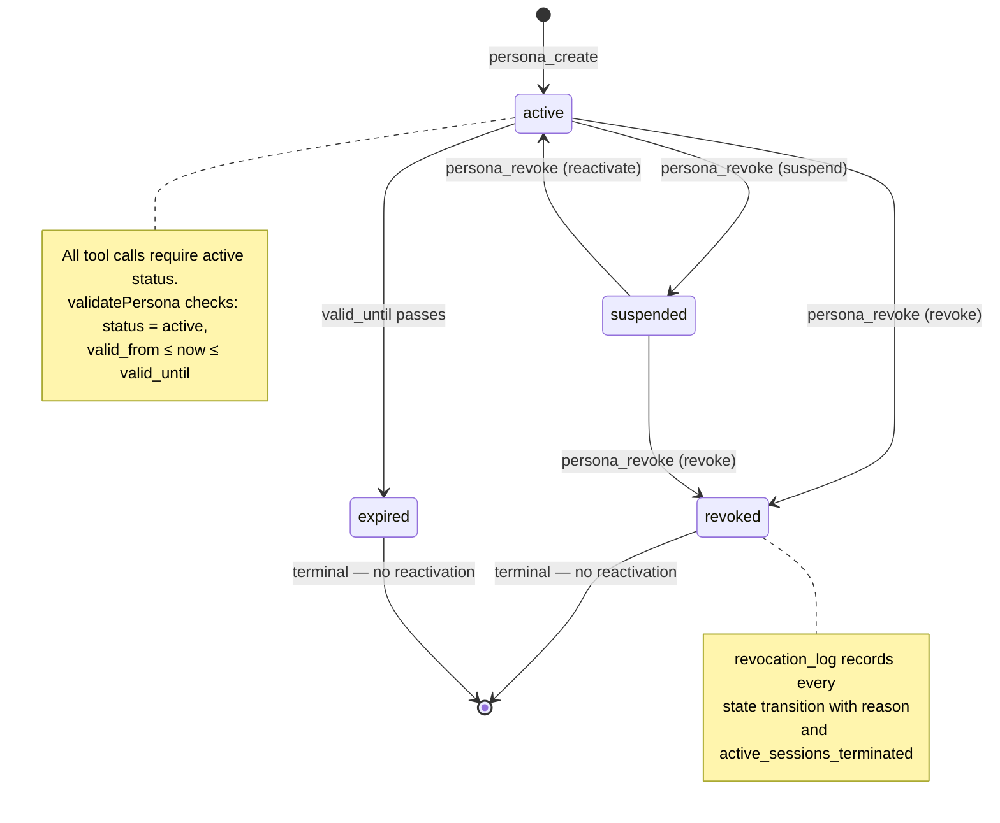
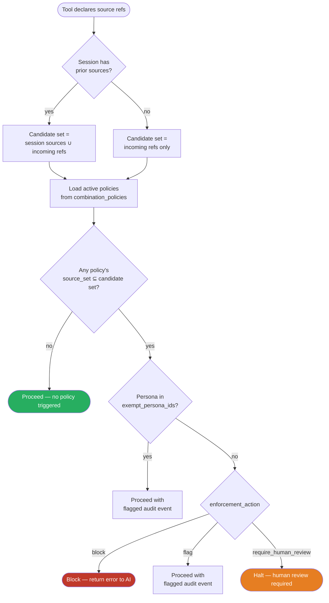

# GIF Architecture Diagrams

Diagrams are Mermaid — render in GitHub, VS Code (Markdown Preview Enhanced), or any Mermaid-compatible viewer.
Edit the source blocks directly; no image tools required.

---

## 1. Request Flow — Tool Call Through Enforcement

How a single tool call travels from an AI client through gif and back.

---

## 2. Schema — GIF Tables and Relationships

All tables live in the `gif` schema. External objects (adopter schema) are shown separately.

> **Note:** `audit_events` is range-partitioned by month (`occurred_at`).
> Each partition is `audit_events_YYYY_MM`. Operator provisions next month's
> partition on the first working day of the preceding month.

---

## 3. Adopter Integration — What GIF Provides vs. What Adopters Supply

---

## 4. Persona Lifecycle

---

## 5. Combination Policy Check (ADR-023)

Fires before any tool execution that declares source references.

